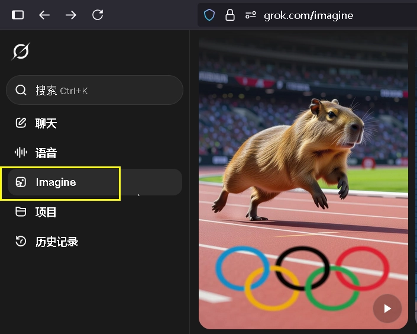
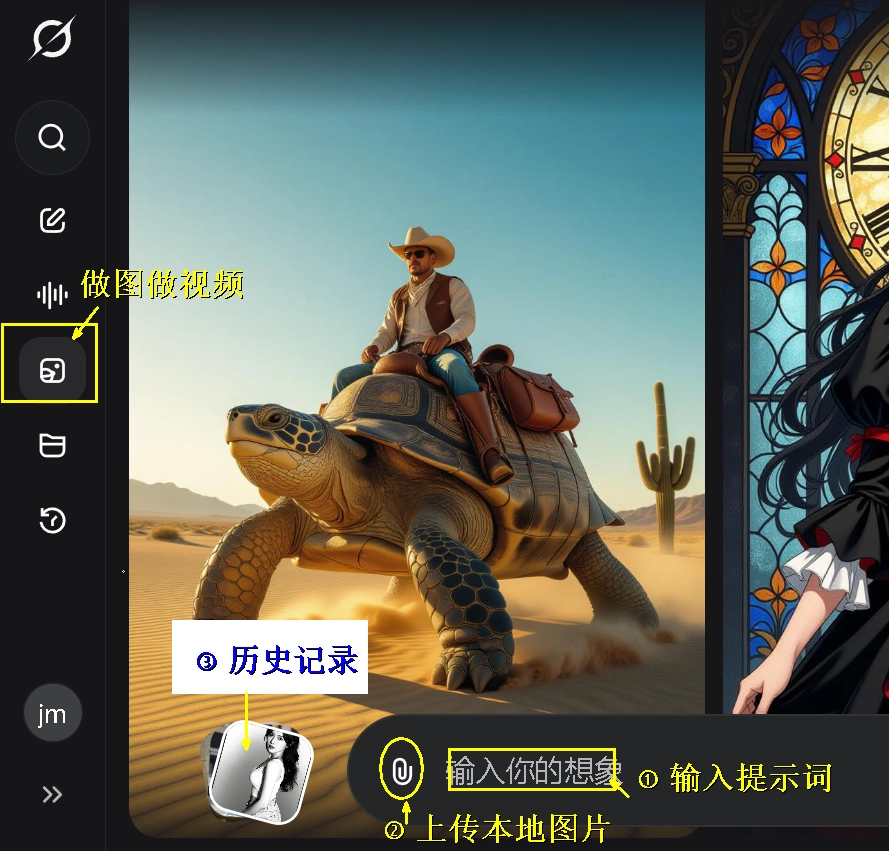
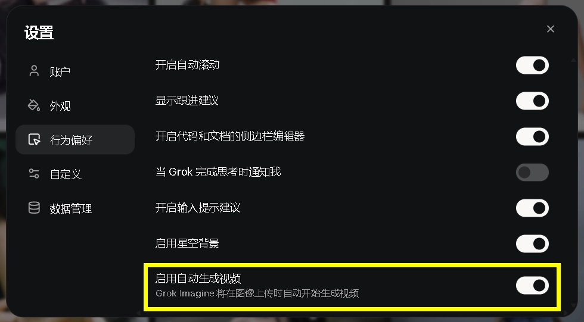
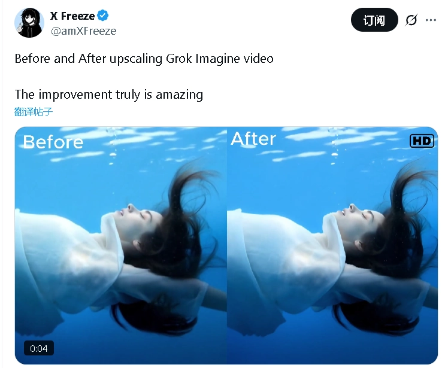
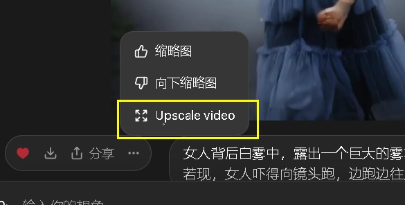
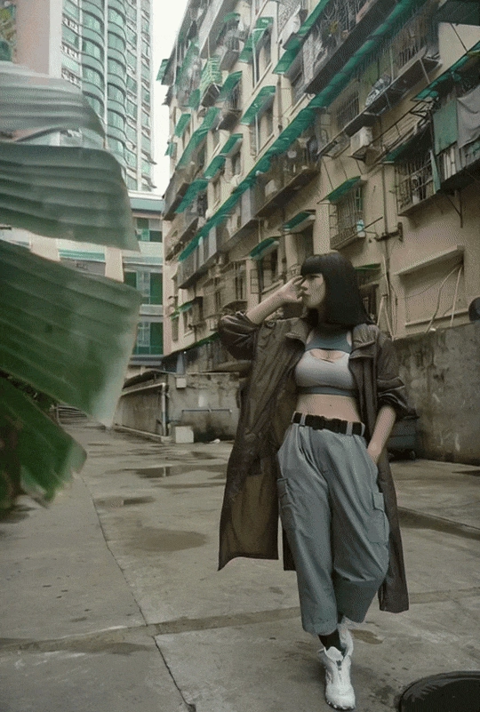
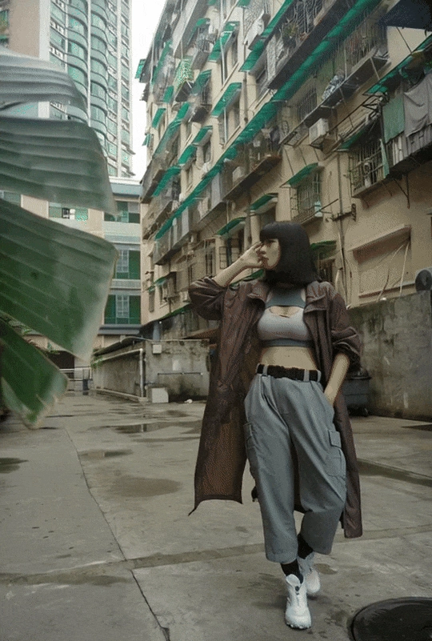
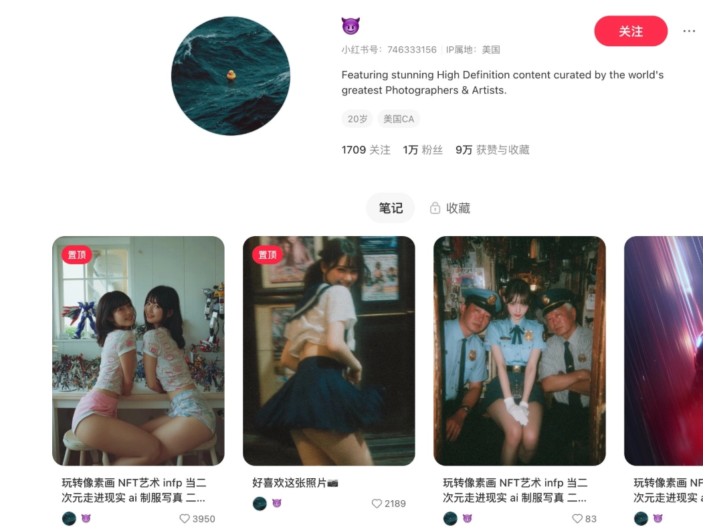

# Grok Imagine 完整攻略：从白嫖到高清，一篇教会你玩转马斯克的视频 AI

---

十月的 AI 视频圈热闹得像过年。谷歌、OpenAI、国内团队轮番放大招，但真正让全球网友集体"上头"的，还是马斯克家的 Grok Imagine。

为什么？运镜丝滑、电影级质感、免费白嫖、尺度够大、还能一键高清——这些理由够不够？

这篇文章直接上硬菜：从入口、白嫖技巧、隐藏骚操作，到官方运镜词库和神级搭配工具，把 Grok Imagine 一次讲透。

---

## 一、在哪用？怎么白嫖？

### 官方入口

只有一个官网：**grok.com**

APP 也叫 **GROK**，登录后点击左侧"Imagine"按钮，就能进入作图和视频生成界面。

### 免费额度

一个免费账户每天可生成 20 个 6 秒视频。生成速度快得离谱——10 秒一个！同一张图可以多次生成不同版本，点击左右箭头切换查看。

### 白嫖方法（重点）

一个账户一天只有 20 个视频？不够用？

教你一招：去 **2925 电子邮局**（www.2925.com）申请一个免费邮箱。

比如你申请了 `smartboy@2925.com`，那么 `smartboy1@2925.com`、`smartboy2@2925.com`、`smartboy3@2925.com`……这些地址默认都是你的，但 Grok 会把它们当成不同邮箱，可以分别注册账号。

10 个邮箱 = 200 个免费视频额度。够你玩一阵子了。

---

## 二、使用技巧（5 个必知骚操作）

### 1. 文生视频（绕过限制）

默认只支持图生视频。但有个技巧可以绕开这个限制：

上传一张**非常小的纯白或纯黑色块**，然后输入文字描述，就能变相实现文生视频。

虽然效果不如图生视频，但在找不到合适图片时，这招很好用。

比如这个提示词：

> "韩式少女自拍视频：白皙瓷肌的东亚女孩，慵懒侧坐黑皮沙发，灰卫衣半褪香肩，白短背心与抽绳短裤，赤脚。凌乱高丸子与碎发帘,左眼下小痣。她歪头 5°，右手背托下巴，右眼直视镜头，左眼俏皮 wink，粉嫩腮红与渐变唇。背景极简白墙，旁放银色 MacBook。"

生成效果还不错。

### 2. 无提示生图

上传图片后，不输入任何提示词，Grok 会自动理解图片内容并生成视频。这个功能可以在系统设置里关闭。

### 3. 时间线控制

Grok Imagine 支持在提示词中加入时间点，按秒控制动作节奏。

举个例子（来自网友阿真的分享）：

**整体构思**：一个天真勇敢的少年驾驶复古飞行器穿越云层，镜头捕捉阳光、风与梦想交织的瞬间。

**分镜脚本**：  
- [0-1 秒] 特写 - 少年目光望向远方，阳光洒在脸上，风轻拂发丝  
- [1-3 秒] 中景 - 飞行器穿过云层，阳光反射在金属机翼上，少年微笑  
- [3-5 秒] 镜头环绕 - 飞行器掠过明亮云海，光线闪烁如梦  
- [5-6 秒] 慢速推进 - 少年露出坚定表情，背景出现更高的天空层

这种分镜式的时间线控制，能让视频节奏感更强。

### 4. 一键高清（Upscale）

这是 Grok Imagine 最新上线的功能，连马斯克都忍不住秀了一把。

使用方法：生成视频后，点击输入框左边的三个点"..."，选择 Upscale。

相比谷歌的油腻高清和 OpenAI 的全面模糊，让用户自己选择满意的视频再高清，确实是全球独一份的体验。

### 5. 尺度设置

支持 4 种尺度：普通、搞笑、火辣、自定义。

其中"火辣"（Spicy）模式需要年龄验证。如果想找到 Grok Super 会员服务，顺带解锁更多高级功能，不妨考虑 👉 [Grok Super 会员一个月成品号（质保30天）](https://shaoyumi.com/buy/66)，省去繁琐验证流程。

触发验证方法：  
- 网页版没有设置入口，需要先登录 GROK 应用  
- Android 版登录后等半小时，网页版就能触发验证  
- iOS 可以跟 18+ 用户互动，触发设置出生年份选项

温馨提示：动画卡通的尺度比真人大。

### 6. 神器搭配

Grok Imagine 虽强,但搭配其他工具效果更佳：

**图片搭子**：让 Nano-banana 按照图库重新出图，再用 Grok 生成视频。

**姿势搭子**：找一些动作词库——瑜伽动作指南、八段锦指南、舞蹈姿势词库、体操术语……或者在线动作图库（参考《六个神器，让你的 AI 人物实现姿势自由》）。

---

## 三、运镜提示词库（电影级必备）

Grok Imagine 支持非常多的动作和运镜提示词，包括官方推荐的和网友总结的。这些"摄影师动词"写清楚了，才能拍出纯正的电影级运动镜头。

### 官方提示词（核心关键词）

把这些词加进提示词里，视频会更有电影感：

- 超逼真的电影镜头  
- 多个动态摄像机角度  
- 旋转轨道平移  
- 慢速推拉特写  
- 广角定场镜头  
- 360 度旋转  
- 逼真的灯光  
- 镜头光晕  
- 景深  
- 超高细节  
- 实时运动模糊  
- HDR / 16K 电影画质  
- 镜头之间无缝过渡  
- IMAX 级电影摄影  
- 细微的相机抖动  
- 视差 / 体积照明 / 柔和的高光

### 镜头动作速查（写进 Prompt 的关键词）

**Pan**：水平旋转取景，像把头左右转。  
**Tilt**：垂直旋转取景，像点头抬头。  
**Zoom In / Out**：镜头焦距推近/拉远，机位不动。  
**Dolly In / Out**：机位前进/后退，带来"进入/拉开全景"的空间感。  
**Tracking Shot**：跟随主体同向移动，始终把运动主体留在画面里。  
**Crane Shot**：升降机位上下移动，制造高/低机位的戏剧视角。  
**Handheld**：手持轻晃，增强真实感与紧迫感。  
**Orbit**：环绕主体移动，一圈展示立体信息与动势。

**实用写法**（1 个镜头只用 1 种运动，避免叠加）：

> "Golden hour city rooftop, hero steps into light; slow dolly-in to waist-up; subtle tilt up at the last second; soft rim light, shallow depth of field."

### Prompt 模板（可直接套用）

**场景/时间/质感**：[location], [time of day], [look]  
**主体与动作**：subject does [clear action]  
**镜头运动**：pan / tilt / zoom in|out / dolly in|out / tracking / crane / handheld / orbit（只选一项）  
**画面语言**：shot size, composition, DoF  
**光线与色彩**：key/rim/fill, color palette  
**节拍**：hold 1s then cut

### 进阶小贴士

- 写清动作 → 镜头 → 光线 → 节拍的顺序，少用"漂亮/电影感"等空词  
- 想更稳？把 10 秒拆成 2-3 个镜头块，每块 3-4 秒  
- 需要真实临场感？试 handheld  
- 想增强空间叙事？用 dolly  
- 要展示完整形体？选 orbit

**收藏用句**：  
- "slow dolly-in to medium close-up, hold 1s before cut."  
- "tracking shot left-to-right, subject center-frame, steady gimbal."  
- "crane shot rising 3m to reveal skyline, soft backlight."

---

## 四、实战案例（6 个场景）

### 案例 1：恐怖片

**提示词**：镜头快速向中心推近,特写嘴唇，张开嘴，爬出白色的蛆虫，越来越多。

效果：惊悚感十足，适合做恐怖短片。

### 案例 2：飞行

**提示词**：助跑，飞向山顶。

效果：动作流畅，运镜跟随自然。

### 案例 3：镜头环绕

**提示词**：人物姿势不变，镜头以人物为中心水平环绕。

效果：360 度展示人物细节，适合产品展示或角色介绍。

### 案例 4：镜头跟随

**提示词**：镜头光速穿过画面进入发光的地方，并且向下极速掉入悬崖，外面的场景是世外桃源，有山、有河流，很唯美。

效果：奇幻感强，适合魔幻题材。

### 案例 5：镜头拉远

**提示词**：镜头快速往后拉，上升到高空航拍视角，展示城市全景宏大叙事。

效果：震撼，适合开场或结尾。

### 案例 6：创意视频

**提示词**：女人爬上旁边的居民楼。

效果：脑洞大开，适合做创意短片。

---

## 五、引流变现（实战案例）

Grok Imagine 的惊艳功能，非常适合在自媒体平台变现。

举个例子：有个账号起号才 5 天，就涨了 1 万粉丝。怎么做的？利用某大师的摄影作品，用 Grok Imagine 做成小视频发布。

类似的玩法还有很多：广告、影视、电商、本地生活、媒体工具……每一个垂类、每一个场景，都潜伏着海量需求。

---

## 总结

人是视觉动物。Grok Imagine 强大的功能和超大尺度，创意无穷无尽。

从入口到白嫖，从技巧到案例，这篇文章已经把 Grok Imagine 的玩法与灵感一次性讲透了。

如果你想更高效地体验这些功能，不妨试试 👉 [Grok Super 会员一个月成品号（质保30天）](https://shaoyumi.com/buy/66)，解锁更多高级玩法，让创作之路更顺畅。

凡是要"被看见"的生意，都值得让 AI 重新做一遍。抓住机会，点亮你的创意，开始变现吧。
